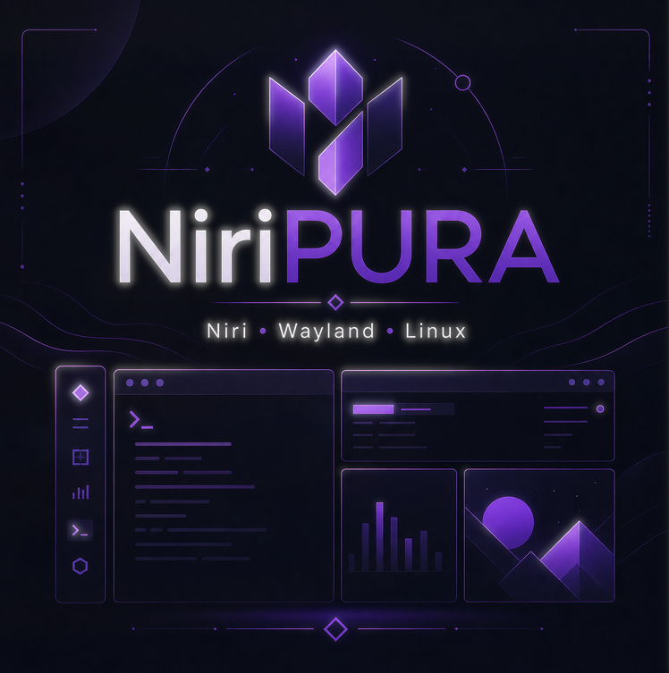

<p align="center">
  
</p>

<h3 align="center">Niri + Noctalia v5 — Wayland Linux Desktop</h3>

<p align="center">
  Peach/coral palette (<code>#ffb59f</code>) inspired by Noctara-Dots
</p>

---

## Preview


---

## Display

| Monitor | Resolution | Position | Refresh | Notes |
|---------|-----------|----------|---------|-------|
| DP-2 | 1080x1920 (portrait) | Left | 60Hz | 90° CCW rotated |
| DP-1 | 1920x1080 | Center | 180Hz | Primary |
| HDMI-A-1 | 1920x1080 | Top-right | 60Hz | — |

---

## Workspaces

10 named workspaces with Nerd Font icons on DP-1 (primary). Dynamic numbered workspaces on DP-2 and HDMI-A-1.

| # | Glyph | Name | Icon Source | Purpose |
|---|-------|------|-------------|---------|
| 1 | `` | term | U+EA85 (codicon terminal) | Terminals |
| 2 | `` | web | U+F268 (fa-chrome) | Browsers |
| 3 | `󰳆` | dev | U+F0CC6 (md-dev) | Code/IDE |
| 4 | `` | docs | U+F15C (fa-file-text) | Files/documents |
| 5 | `` | conf | U+EB51 (codicon-comment) | Config |
| 6 | `` | s1b | U+F21B (fa-user-secret) | S1BGroup |
| 7 | `` | sec | U+F132 (fa-shield) | Security tools |
| 8 | `` | chill | U+F11B (fa-gamepad) | Entertainment |
| 9 | `` | games | U+F1B6 (fa-steam) | Games |
| 10 | `` | wm | U+F233 (fa-server) | VMs/hypervisor |

### Workspace Auto-assignment (Window Rules)

| Workspace | Apps | Rule |
|-----------|------|------|
| `web` | zen, firefox, chrome, brave, helium | open-maximized |
| `docs` | dolphin, pcmanfm-qt, thunar | open-floating, fixed 900px |
| `chill` | vesktop, discord, legcord, spotify, thunderbird | — |
| `sec` | BurpSuite, Ghidra, ZAP, Wireshark | — |

### Noctalia Workspace Icons

Workspace widget prefs live in Noctalia UI / `~/.local/state/noctalia/settings.toml`.
A manual snapshot is kept at `noctalia/widget-workspaces.golden.toml` (reference only — not auto-applied).

At login, `scripts/restore-named-workspaces.sh` only moves named workspaces to DP-1.
It does **not** change hide/size/label widget flags — those stay as you set them in Noctalia.

> **Gotcha**: If `font_family` is not a Nerd Font, icons render invisible — you only see the text part of the name.

---

## Keybindings Overview

Press `Mod+Shift+Slash` to show the hotkey overlay. Press `Mod+Shift+W` to open this README in Emacs.

```
╔══════════════════════════════════════════════════════════════════════════════╗
║                           NIRI PURA — KEYBINDINGS                          ║
╠══════════════════════════════════════════════════════════════════════════════╣
║                                                                              ║
║  NOCTALIA SHELL                                                             ║
║  ──────────────────────────────────────────────────────────────────────────  ║
║  Mod+L          🔒  Lock screen                                              ║
║  Mod+D          ⚙   Control Center                                         ║
║  Alt+Space      🚀  App Launcher                                            ║
║  Mod+V          📋  Clipboard                                               ║
║  Mod+N          🔔  Notifications                                          ║
║  Mod+Comma      🖼   Wallpaper picker                                       ║
║  Mod+Period     😀  Emoji picker                                             ║
║  Mod+Escape     🚪  Session menu                                            ║
║  Mod+Alt+I      ⚡  Settings                                                 ║
║                                                                              ║
║  APPLICATIONS                                                               ║
║  ──────────────────────────────────────────────────────────────────────────  ║
║  Mod+E          🍀  Emacs                                                    ║
║  Mod+X          ⬡  Terminal (kitty)                                         ║
║  Mod+F          📁  File manager (pcmanfm-qt)                               ║
║  Mod+Shift+F    🌐  Qutebrowser                                              ║
║  Mod+B          🦎  Zen Browser                                             ║
║  Mod+G          💀  Burpsuite                                               ║
║  Mod+Shift+Z    🛡  OWASP ZAP                                                ║
║  Mod+O          🔑  KeePassXC                                                ║
║  Mod+Z          🎯  Wofi (quick launcher)                                   ║
║  Mod+Space      🚀  Fuzzel (main launcher, glassmorphism)                  ║
║  Mod+A          ☰  Command palette (fz master menu)                        ║
║  Mod+Shift+S    🔎  Web search (fz-search)                                 ║
║  Mod+Shift+B    📋  Clipboard history (fz-clip)                            ║
║  Mod+Shift+V    🪟  Window switcher (fz-windows)                           ║
║  Mod+Shift+N    🎛   Niri actions menu (fz-niri)                           ║
║                                                                              ║
║  WINDOW/COLUMN NAVIGATION — vim-style                                       ║
║  ──────────────────────────────────────────────────────────────────────────  ║
║  Mod+H          ←  Focus column left                                        ║
║  Mod+J          ↓  Focus window down                                        ║
║  Mod+K          ↑  Focus window up                                          ║
║  Mod+;          →  Focus column right                                       ║
║  Mod+Arrow keys also work                                                    ║
║  Mod+Alt+Down/Up  Focus window or workspace (smart)                          ║
║                                                                              ║
║  Mod+Ctrl+H/J/K/L  Move column/window in direction                           ║
║  Mod+Home/End       Focus first/last column                                  ║
║  Mod+Ctrl+Home/End  Move to first/last position                              ║
║                                                                              ║
║  LAYOUT                                                                      ║
║  ──────────────────────────────────────────────────────────────────────────  ║
║  Mod+Q          ✕  Close window                                             ║
║  Mod+Tab        ⊞  Overview (all windows)                                    ║
║  Mod+Shift+A    ⤢  Maximize column                                          ║
║  Mod+Shift+M    ⛶  Fullscreen                                               ║
║  Mod+M          ⛶  Maximize to edges                                         ║
║  Mod+Shift+C    ⊜  Center column                                             ║
║  Mod+Alt+C      ⚖  Uncenter column (70% width)                               ║
║  Mod+Ctrl+C     ⊜  Center all visible columns                                ║
║  Mod+R          ⊡  Cycle column width presets                                ║
║  Mod+T          ⊞  Toggle tabbed display (tabs in column)                    ║
║  Mod+Minus/=    ⇖/⇗  Resize column narrower/wider                            ║
║  Mod+[ / ]      ◀/▶  Consume/expel window left/right                          ║
║                                                                              ║
║  WORKSPACES                                                                  ║
║  ──────────────────────────────────────────────────────────────────────────  ║
║  Mod+1-9        Focus workspace 1-9                                          ║
║  Mod+0          Focus workspace 10 (wm)                                      ║
║  Mod+Grave      Focus previous workspace (toggle 2 last)                     ║
║  Mod+Ctrl+1-9   Move column to workspace 1-9                                 ║
║  Mod+Ctrl+0     Move column to workspace 10                                  ║
║  Mod+Shift+1-0  Move single window to workspace (not column)                 ║
║  Mod+U / I      ⤓/⤒  Workspace down/up                                       ║
║  Mod+Shift+U/I  Move workspace down/up                                       ║
║  Mod+Ctrl+U/I   Move column to adjacent workspace                            ║
║  Mod+Wheel      Scroll workspaces                                            ║
║                                                                              ║
║  MONITORS                                                                    ║
║  ──────────────────────────────────────────────────────────────────────────  ║
║  Mod+Shift+Ctrl+Arrow    Focus monitor in direction                          ║
║  Mod+Shift+Ctrl+H/L      Move workspace to monitor left/right                ║
║  Mod+Alt+Ctrl+Arrow      Move column to monitor                               ║
║  Mod+Alt+X               Toggle output profile (gaming/work)                  ║
║                                                                              ║
║  SYSTEM                                                                      ║
║  ──────────────────────────────────────────────────────────────────────────  ║
║  Mod+Shift+F2  🔊  Audio (pavucontrol)                                       ║
║  Mod+Shift+F3  📱  Bluetooth (blueman)                                       ║
║  Mod+Shift+F4  📶  Network (nm-connection-editor)                            ║
║  F11           🌅  Night light on                                            ║
║  Shift+F11     🌄  Night light off                                            ║
║                                                                              ║
║  MEDIA                                                                       ║
║  ──────────────────────────────────────────────────────────────────────────  ║
║  XF86Audio...  🔈  Volume/Mute/Play/Prev/Next                                ║
║  XF86MonBrightness...  ☀  Brightness up/down                                 ║
║                                                                              ║
║  SCREENSHOTS                                                                 ║
║  ──────────────────────────────────────────────────────────────────────────  ║
║  Mod+P          📷  Screenshot (interactive)                                 ║
║  Mod+Shift+P    🖥   Screenshot current screen                               ║
║  Mod+Ctrl+P     🎯  Screenshot to clipboard                                  ║
║  Ctrl+Alt+Print 🪟  Screenshot focused window                                ║
║                                                                              ║
║  VIDEO WALLPAPER                                                             ║
║  ──────────────────────────────────────────────────────────────────────────  ║
║  Mod+Alt+W      ▶  Toggle video wallpaper on primary monitor                   ║
║  Mod+Alt+N      ⏭  Cycle to next video                                       ║
║                                                                              ║
║  MISC                                                                        ║
║  ──────────────────────────────────────────────────────────────────────────  ║
║  Mod+Ctrl+Escape  ⌨  Toggle keyboard shortcuts inhibit                       ║
║  Ctrl+Alt+Delete  ⏻  Quit Niri                                               ║
║  Mod+Ctrl+Shift+Q ⏻  Quit Niri                                               ║
║                                                                              ║
╚══════════════════════════════════════════════════════════════════════════════╝
```

---

## Mod Keys

| Key | Value |
|-----|-------|
| Mod | Super (Windows key) |
| Alt | Alt |
| Ctrl | Control |
| Shift | Shift |

---

## Fuzzel Launcher & Scripts

**Fuzzel** (`Mod+Space`) is the main app launcher — compact cyberpunk red team styling with glassmorphism blur (background layer-rule in `layer-rules.kdl` applies Niri blur behind the menu).

### Scripts (`~/.local/bin/fz-*`)

| Script | Keybind | What it does |
|--------|---------|--------------|
| `fz` | `Mod+A` | **Master command palette** — Raycast-style hub that dispatches to all submenus below |
| `fz-search` | `Mod+Shift+S` | Web search — pick engine (Google/DuckDuckGo/GitHub/YouTube/Reddit/Wikipedia/AUR/Steam/man), type query, opens in zen-browser |
| `fz-calc` | — | Calculator — type expression, live result via `bc -l`, Enter copies result |
| `fz-run` | — | Run command — fuzzy-search zsh history + 5500+ PATH executables, runs in kitty |
| `fz-clip` | `Mod+Shift+B` | Clipboard history (daemon `--watch` captures copies; `--clear` wipes). Paste with Enter, clear with `Mod+Backspace` |
| `fz-windows` | `Mod+Shift+V` | Window switcher — parses `niri msg windows`, fuzzy-search, focus selected |
| `fz-niri` | `Mod+Shift+N` | Niri actions menu (14 actions: float, fullscreen, screenshot, layouts, etc.) |
| `fz-pass` | — | KeePassXC password search — `--password` mode for master key, copies password (auto-clears after 15s). Needs `KEEPASS_DB` or path arg |
| `fz-ssh` | — | SSH host picker — parses `~/.ssh/config` aliases, connects in kitty |
| `fz-notes` | — | Markdown notes — lists/creates notes in `~/Notes`, opens in Emacs |
| `fz-power` | — | Power menu (lock, suspend, reboot, shutdown) — run manually or add a keybind |
| `fz-emoji` | — | Emoji picker (copies emoji, exits) — run manually or add a keybind |

### Key design details

- **dmenu mode**: scripts pipe options into `fuzzel --dmenu` (mode=text, `exit-immediately-if-empty`).
- **Compact layout**: `width=55`, `lines=10`, `line-height=26` — intentionally NOT big.
- **Cyberpunk red team palette**: green base (`#9ab89a`) + red/purple accents (`#ff2d78` prompt/selection-match, `#d04dff` match, `#00ff41` border).
- **Message banner**: `// the wired 🌐` shows below the prompt (message-mode=expand).
- **Glassmorphism**: `layer-rules.kdl` sets `blur true; xray true` for namespace `launcher`; background `0a0f0acc` + border radius 8 keeps corners clean.

### Gotchas (learned the hard way)

1. **Stale lock file**: Fuzzel writes `/run/user/$(id -u)/fuzzel-wayland-1.lock` and refuses to start if it exists ("fuzzel already running?"). All `fz-*` scripts `rm -f` it before launching.
2. **Keybind conflicts are silent**: `Mod+Shift+C` was already `center-column` — the new binding simply didn't fire. Always check existing binds before adding.
3. **Niri spawn PATH**: scripts need absolute paths in keybinds (`spawn "/home/il1v3y/.local/bin/fz-clip"`) — Niri's environment may not include `~/.local/bin`.

---

## Column Centering & Positioning

Niri provides flexible column positioning with three distinct modes: centered (full-width), uncentered (reduced width), and floating (manual drag).

### Keybinds

| Keybind | Action | Description |
|---------|--------|-------------|
| `Mod+Shift+C` | `center-column` | Centers the focused column at full workspace width |
| `Mod+Alt+C` | `niri-toggle-center` | Reduces column width to 70% (uncenters) |
| `Mod+Ctrl+C` | `center-visible-columns` | Centers all visible columns |
| `Mod+Shift+Ctrl+V` | `toggle-window-floating` | Converts window to floating mode for manual positioning |
| `Mod+Ctrl+V` | `switch-focus-between-floating-and-tiling` | Switches focus between floating and tiling windows |

### Workflow

**Single window:**
1. Open window → centered by default (full width)
2. `Mod+Alt+C` → reduces to 70% width (uncentered)
3. `Mod+Shift+C` → back to full width (centered)

**Multiple windows:**
1. Open second window → both columns visible, tiled layout
2. `Mod+Shift+C` → centers the focused column
3. `Mod+Alt+C` → uncenters (reduces width to 70%)
4. `Mod+Ctrl+Left/Right` → reorder columns

**Manual positioning (floating mode):**
1. `Mod+Shift+Ctrl+V` → convert window to floating
2. Drag with mouse to desired position
3. `Mod+Ctrl+V` → return to tiling mode

### Script: `niri-toggle-center`

Location: `~/.local/bin/niri-toggle-center`

```bash
#!/bin/bash
# Uncenter column by reducing its width
# When a column is narrower than the workspace, Niri positions it to the left

set -euo pipefail

# Reduce column width to 70% (positions it to the left)
niri msg action set-column-width "70%"
```

### Configuration

In `config.kdl`, the `always-center-single-column` option is **disabled**:

```kdl
layout {
    gaps 7
    center-focused-column "never"
    // always-center-single-column  // Disabled: windows stay at their column position
}
```

This means single windows stay at their natural column position instead of being forced to center. Use `Mod+Shift+C` to center manually when desired.

### Notes

- **Uncenter with 1 window**: `Mod+Alt+C` reduces width to 70%, positioning the column to the left side of the workspace.
- **Uncenter with 2+ windows**: Same behavior, but you can also use `Mod+Ctrl+Left/Right` to reorder columns.
- **Floating mode**: Use when you need precise manual positioning (e.g., for screenshots, presentations, or specific layouts).

---

## Files

```
~/.config/niri/
├── config.kdl              # Main config (layout, cursor, includes)
├── modules/
│   ├── autostarts.kdl     # Apps that start with session
│   ├── decorations.kdl    # Borders, shadows, focus rings
│   ├── input.kdl          # Keyboard/mouse settings
│   ├── keybinds.kdl       # All keybindings
│   ├── layer-rules.kdl    # Layer shell rules
│   ├── monitors.kdl       # Monitor config
│   ├── window-rules.kdl   # Window behavior rules
│   └── workspaces.kdl     # Named workspaces with Nerd Font icons
├── scripts/
│   ├── toggle-output-profile.sh
│   └── video-wallpaper.sh
├── noctalia.kdl           # Noctalia theme overrides (colors)
└── README.md              # This file

~/.local/bin/
├── fz                    # Master command palette (Mod+A)
├── fz-search             # Web search engine picker (Mod+Shift+S)
├── fz-calc               # Calculator (bc -l)
├── fz-run                # Command runner (zsh history + PATH)
├── fz-clip               # Clipboard history (daemon --watch)
├── fz-windows            # Window switcher
├── fz-niri               # Niri actions menu
├── fz-pass               # KeePassXC password search
├── fz-ssh                # SSH host picker
├── fz-notes              # Markdown notes manager
├── fz-power              # Power menu
├── fz-emoji              # Emoji picker
└── niri-toggle-center    # Uncenter column (Mod+Alt+C)

~/.local/state/noctalia/
├── settings.toml          # Noctalia runtime settings (bar, widgets) — LIVE state
└── (repo) noctalia/widget-workspaces.golden.toml  # manual snapshot (not auto-applied)
```

---

## Tips

1. **Niri hot-reloads config** on file save — no restart needed. Parse errors show as on-screen indicator.
2. **Workspace icons** require Nerd Font in `font_family` setting. Fira Sans / Inter = no icons.
3. **Workspaces are per-output** — named workspaces live on DP-1 only. DP-2/HDMI-A-1 get dynamic numbered workspaces. Same keybinds (`Mod+1..10`) work on all monitors.
4. **Window rules auto-assign** apps to workspaces (zen→web, burp→sec, discord→chill, etc.).
5. **Video wallpaper** requires `mpvpaper`. Toggle with `Mod+Alt+W`.
6. **Night light** (`F11`) sets 3500K. `Shift+F11` disables.
7. **Output profile** (`Mod+Alt+X`) toggles gaming/work modes.
8. **Fuzzel glassmorphism** needs the blur layer-rule in `layer-rules.kdl` — match namespace `launcher`, `xray true` for per-window blur.

---

## Troubleshooting

| Issue | Solution |
|-------|----------|
| Workspace icons show as letters only | Set `font_family = "MesloLGL Nerd Font"` in `[widget.workspaces]` (Noctalia settings) |
| Named workspaces on wrong monitor after login | Autostart runs `scripts/restore-named-workspaces.sh` (pins named WSs to DP-1 only) |
| Widget hide/size/label prefs | Owned in Noctalia UI — restore script does **not** overwrite them |
| Workspace order wrong after config reload | Hot-reload inserts named workspaces at top (reverse order). Fix: `niri msg action move-workspace-to-index --reference "name" N` |
| Window not on expected workspace | Check `open-on-workspace` in window-rules.kdl — name must match exactly |
| Hotkey overlay shows at startup | Fixed with `skip-at-startup` in config |
| Video wallpaper not working | Check `mpvpaper` is installed |
| fz-* script does nothing on keybind | Check for stale fuzzel lock (`ls /run/user/$(id -u)/fuzzel-wayland-1.lock`) — scripts clean it, but check keybind uses absolute path; verify no Niri keybind conflict (`grep -oE "Mod\+Shift\+[A-Za-z]" modules/keybinds.kdl \| sort -u`) |
| Slow session startup | Services like emacs/openrgb start with 5-10s delay |

---

## Links

- [Niri GitHub](https://github.com/niri-wm/niri)
- [Niri Wiki](https://yalter.github.io/niri/)
- [Noctalia GitHub](https://github.com/noctara-dots/noctalia)
- [Nerd Fonts](https://www.nerdfonts.com/)
